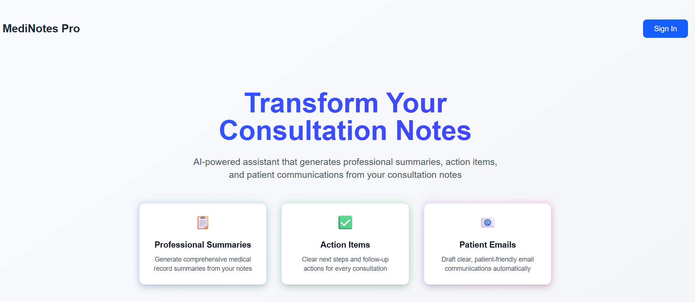
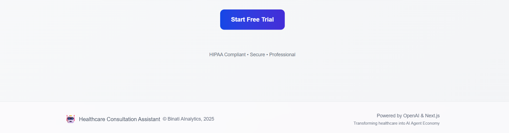
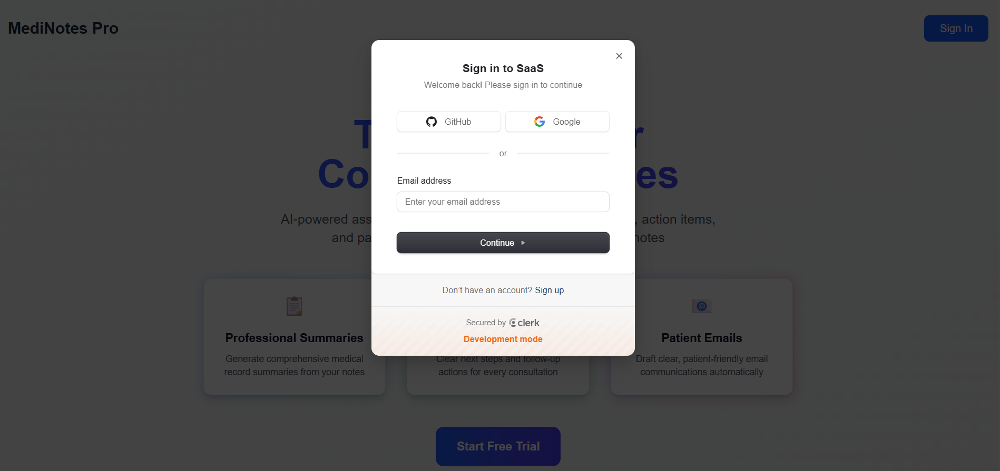
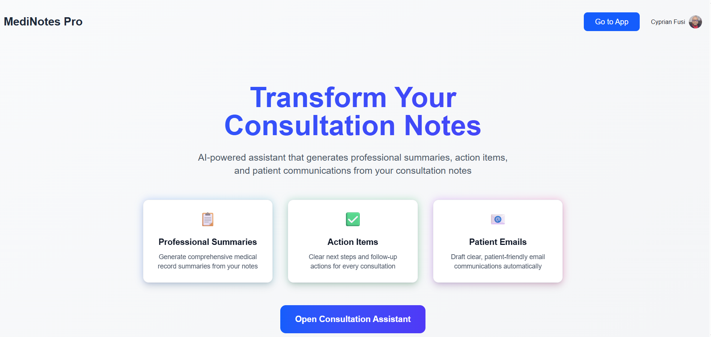
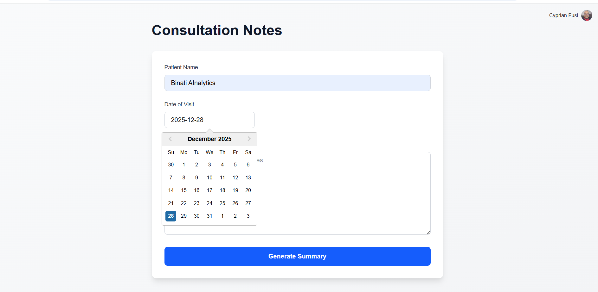
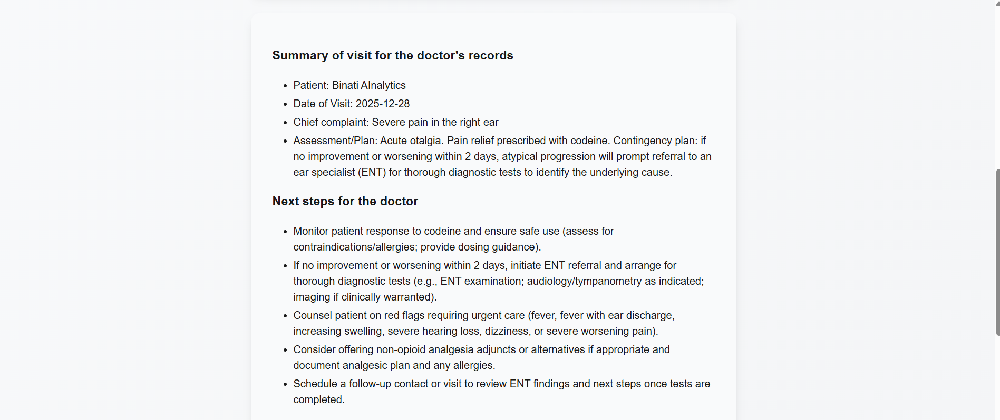
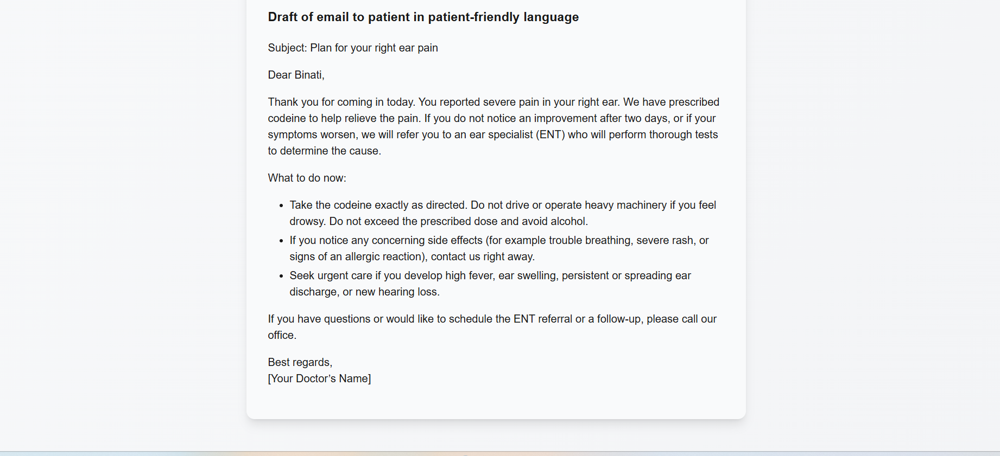

# MediNotes Pro

<div align="center">
  

  **AI-Powered Healthcare Consultation Assistant**

  Transform your consultation notes into professional summaries, actionable next steps, and patient-friendly communications.

  [](https://saas-9gxlxmfd5-cyprian-fusis-projects.vercel.app)
  [](https://nextjs.org/)
  [](https://fastapi.tiangolo.com/)
  [](https://www.typescriptlang.org/)
</div>

---

## Overview

MediNotes Pro is a SaaS application designed for healthcare professionals to streamline their workflow. Using advanced AI, it transforms raw consultation notes into three essential outputs:
- Professional summaries for medical records
- Clear action items and next steps
- Patient-friendly email communications

**Live Application**: [https://saas-9gxlxmfd5-cyprian-fusis-projects.vercel.app](https://saas-9gxlxmfd5-cyprian-fusis-projects.vercel.app)

---

## Features

### Core Functionality
- **Professional Summaries**: Generate comprehensive medical record summaries from consultation notes
- **Action Items**: Automatically extract clear next steps and follow-up actions
- **Patient Communications**: Draft patient-friendly emails in accessible language
- **Real-time Streaming**: Live AI-generated responses using Server-Sent Events (SSE)

### Security & Authentication
- **Clerk Authentication**: Secure user authentication and session management
- **Subscription Protection**: Premium subscription-based access control
- **JWT Authorization**: Secure API endpoints with bearer token authentication
- **HIPAA Compliance**: Built with healthcare data privacy in mind

### User Experience
- **Modern UI**: Clean, responsive interface with dark mode support
- **Date Selection**: Integrated date picker for visit documentation
- **Markdown Rendering**: Rich text formatting for generated summaries
- **Real-time Updates**: Streaming responses for immediate feedback

---

## Screenshots

<div align="center">
  
  
  <p><em>Landing page with feature overview</em></p>

  
  <p><em>Secure authentication</em></p>

  
  <p><em>Secure authentication flow</em></p>
  
  
  <p><em>Consultation Form</em></p>
  
  <p><em>Consultation notes input form</em></p>
  
  
  
  <p><em>Real-time AI summary generation</em></p>
  
</div>

---

## Tech Stack

### Frontend
- **Framework**: Next.js 16.1 (React 19.2)
- **Language**: TypeScript 5
- **Styling**: Tailwind CSS 4
- **Authentication**: Clerk Next.js
- **UI Components**:
  - React DatePicker for date selection
  - React Markdown with GitHub Flavored Markdown support
- **API Communication**: Microsoft Fetch Event Source for SSE

### Backend
- **Framework**: FastAPI
- **Language**: Python
- **AI Integration**: OpenAI GPT-5-nano
- **Authentication**: Fastapi-Clerk-Auth
- **Server**: Uvicorn (ASGI)
- **Validation**: Pydantic

### Deployment
- **Platform**: Vercel
- **CI/CD**: Automated deployment from Git

---

## Getting Started

### Prerequisites
- Node.js 20+ and npm/yarn
- Python 3.8+
- OpenAI API key
- Clerk account and API keys

### Installation

1. **Clone the repository**
   ```bash
   git clone https://github.com/CyprianFusi/saas-healthcare-medinotes.git
   cd saas-healthcare-medinotes
   ```

2. **Install frontend dependencies**
   ```bash
   npm install
   ```

3. **Install backend dependencies**
   ```bash
   pip install -r requirements.txt
   ```

4. **Set up environment variables**

   Create a `.env.local` file in the root directory:
   ```env
   # Clerk Authentication
   NEXT_PUBLIC_CLERK_PUBLISHABLE_KEY=your_clerk_publishable_key
   CLERK_SECRET_KEY=your_clerk_secret_key
   CLERK_JWKS_URL=your_clerk_jwks_url

   # OpenAI
   OPENAI_API_KEY=your_openai_api_key
   ```

### Running Locally

1. **Start the backend API**
   ```bash
   cd api
   python index.py
   ```
   The API will run on `http://localhost:8000`

2. **Start the frontend development server**
   ```bash
   npm run dev
   ```
   The app will be available at `http://localhost:3000`

---

## Usage

### For Healthcare Professionals

1. **Sign In**: Create an account or sign in using Clerk authentication
2. **Subscribe**: Choose a premium subscription plan to access the app
3. **Enter Consultation Details**:
   - Patient name
   - Date of visit
   - Detailed consultation notes
4. **Generate Summary**: Click "Generate Summary" to receive:
   - Professional summary for records
   - Next steps and action items
   - Draft email for patient communication
5. **Review & Use**: Copy and customize the generated content as needed

---

## API Documentation

### Endpoint: `POST /api`

Generate consultation summaries from patient visit notes.

**Authentication**: Required (Bearer JWT token)

**Request Body**:
```json
{
  "patient_name": "string",
  "date_of_visit": "YYYY-MM-DD",
  "notes": "string"
}
```

**Response**: Server-Sent Events (SSE) stream with markdown-formatted content

**Example**:
```bash
curl -X POST https://your-api-url/api \
  -H "Content-Type: application/json" \
  -H "Authorization: Bearer YOUR_JWT_TOKEN" \
  -d '{
    "patient_name": "John Doe",
    "date_of_visit": "2025-12-28",
    "notes": "Patient presents with headache..."
  }'
```

---

## Project Structure

```
.
├── api/
│   └── index.py              # FastAPI backend
├── assets/
│   ├── binati_logo.png       # Logo
│   └── ui_*.png              # Screenshots
├── pages/
│   ├── _app.tsx              # Next.js app wrapper
│   ├── _document.tsx         # Custom document
│   ├── index.tsx             # Landing page
│   └── product.tsx           # Main application
├── package.json              # Node dependencies
├── requirements.txt          # Python dependencies
├── tsconfig.json             # TypeScript config
├── tailwind.config.js        # Tailwind configuration
└── README.md                 # This file
```

---

## Deployment

### Vercel Deployment

This application is optimized for Vercel deployment:

1. **Connect your repository** to Vercel
2. **Configure environment variables** in Vercel dashboard
3. **Deploy**: Vercel will automatically build and deploy

The backend FastAPI service is deployed as a Vercel serverless function.

---

## Environment Variables

| Variable | Description | Required |
|----------|-------------|----------|
| `NEXT_PUBLIC_CLERK_PUBLISHABLE_KEY` | Clerk public API key | Yes |
| `CLERK_SECRET_KEY` | Clerk secret key | Yes |
| `CLERK_JWKS_URL` | Clerk JWKS endpoint URL | Yes |
| `OPENAI_API_KEY` | OpenAI API key | Yes |

---

## Contributing

Contributions are welcome! Please follow these steps:

1. Fork the repository
2. Create a feature branch (`git checkout -b feature/AmazingFeature`)
3. Commit your changes (`git commit -m 'Add some AmazingFeature'`)
4. Push to the branch (`git push origin feature/AmazingFeature`)
5. Open a Pull Request

---

## Security & Compliance

- **HIPAA Considerations**: While built with healthcare privacy in mind, ensure your deployment meets all HIPAA requirements
- **Data Security**: All API communications use HTTPS and JWT authentication
- **No Data Storage**: Consultation notes are processed in real-time and not stored by the application
- **Third-party Services**: Uses Clerk (authentication) and OpenAI (AI processing) - review their compliance certifications

---

## License

This project is proprietary software developed by Binati AInalytics.

---

## About Binati AInalytics

Transforming healthcare into the AI Agent Economy.

**Contact**: For enterprise licensing and support inquiries, please visit our website.

---

## Acknowledgments

- Built with [Next.js](https://nextjs.org/)
- Powered by [OpenAI](https://openai.com/)
- Authentication by [Clerk](https://clerk.com/)
- UI styled with [Tailwind CSS](https://tailwindcss.com/)

---

<div align="center">
  Made with care for healthcare professionals

  © 2025 Binati AInalytics. All rights reserved.
</div>
